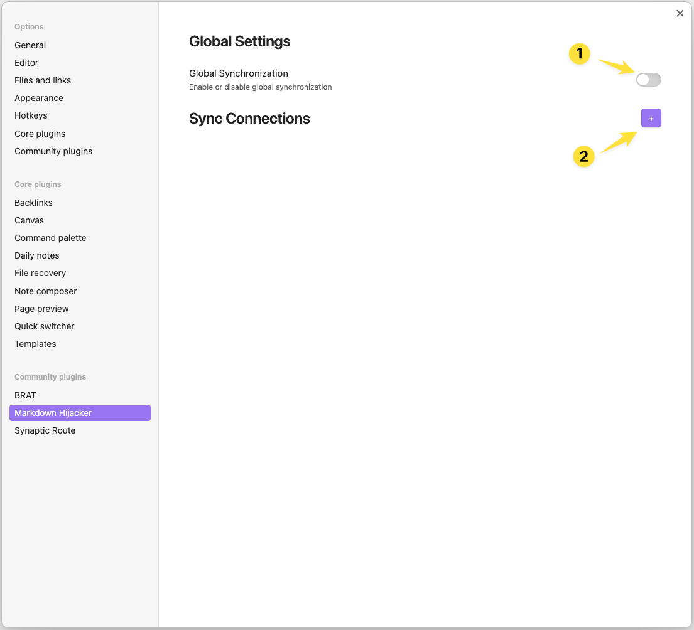
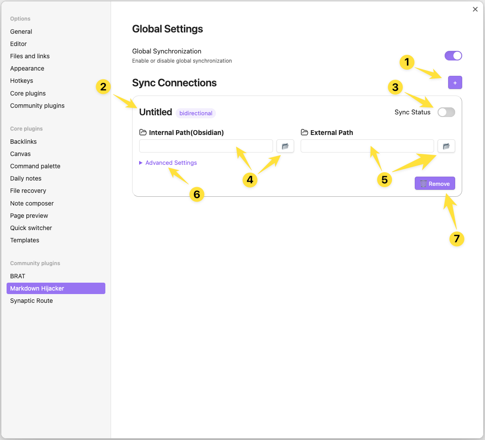
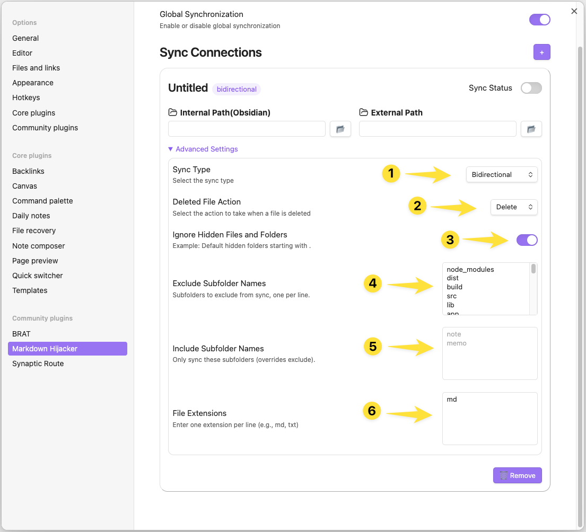

# Synaptic Bridge

> Beyond the Vault. One hub for every Markdown, everywhere.

Synaptic Bridge is an Obsidian plugin that synchronizes markdown and any file extensions you specify between your Obsidian Vault and external folders. With this plugin, you can keep your notes and documents in sync across different locations and tools, improving your workflow and flexibility.

## Release Notes

- See the latest and upcoming features in [RELEASE_NOTE.md](./RELEASE_NOTE.md)

## Key Features

- **Multiple Folder Mappings**: Connect multiple external folders to your Vault folders.
- **Flexible Synchronization**:
    - One-way sync (External → Vault): Import changes from external folders into your Vault.
    - One-way sync (Vault → External): Export changes from your Vault to external folders.
    - Bidirectional sync: Keep both Vault and external folders in sync, reflecting changes both ways.
- **Real-time File Monitoring**: Automatically synchronize files as soon as changes are detected.
- **Offline Change Detection**: If changes are made to external folders while Obsidian is closed, the plugin will detect and synchronize those changes the next time Obsidian is launched.
- **Customizable Settings**: Include or exclude specific folders/files, specify which file extensions to sync, and customize how deletions are handled.
- **Metadata Preservation**: Automatically manage file metadata (frontmatter) for tracking and sync status.
- **Deletion Handling Options**: Choose whether deletions actually remove files, or simply mark them as deleted by changing metadata and adding a "❌" prefix to the filename.
- **Status Indicator**: View synchronization status in the Obsidian status bar.

## Use Cases

- **Integrate Existing Markdown Documents**: Bring your existing markdown documents (and other supported file types) from other locations into your Obsidian Vault.
- **Backup and Redundancy**: Automatically back up important documents or manage synchronization across multiple locations.
- **Edit Notes Without Obsidian**: You can edit your notes for programming, study, or other purposes without having to open Obsidian—just use your favorite editor in the external folder.
- **Freedom with Other Markdown Apps**: Freely use other markdown-based apps in their own independent space, while keeping everything in sync with your Vault.

## Installation

1. In Obsidian, go to Settings(⚙️) > Community Plugins > Browse
2. Search for "Synaptic Bridge" and install
3. Enable the plugin

## Configuration

### 1. Basic Settings

1. Go to Settings(⚙️) > Community Plugins > Synaptic Bridge settings
2. Toggle "Enable Plugin" to activate all features

### 2. Initial Settings

1. **Global Synchronization**: Turn this ON to enable all synchronization features of the plugin, or OFF to disable them globally.
2. **Sync Connections**: Click the "+" button to add a new sync connection pair.

### 3. Folder Mapping Setup

1. Click the "+" button to create a new connection.
2. Click the title to rename the connection.
3. Click the sync status toggle to enable or disable synchronization for this connection.
4. **Internal Path**: Set the relative path within your Vault (use the folder finder button if needed).
5. **External Path**: Set the absolute path to the external folder to synchronize (use the folder selection button if needed).
6. **Advanced Settings**: Click here to configure detailed options for this connection.
7. **Delete Button** : Click the trash icon to remove this sync connection.

> **Note:** When you change any option in Folder Mapping Setup or Advanced Settings, the corresponding sync will be automatically disabled for safety. After updating all settings, make sure to re-enable the mapping to resume synchronization.

### 4. Advanced Settings

1. **Synchronization Direction**:
    - External→Vault: Import external changes to Vault only
    - Vault→External: Export Vault changes to external folders only
    - Bidirectional: Reflect changes in both directions
2. **Deleted File Handling**:
    - Property Change: Mark as deleted (add "❌" prefix to filename and update metadata)
    - Complete Deletion: Fully delete from the connected folder
3. **Ignore Hidden Files and Folders**: Toggle whether to include or exclude hidden files and folders (those starting with a dot).
4. **Exclude Subfolder Names**: Enter the names of subfolders to exclude from sync, one per line.
5. **Include Subfolder Names**: Enter the names of subfolders to include for sync. If set, only these subfolders will be synced and Exclude Subfolder Names will be ignored.
6. **File Extensions**: Enter file extensions to include for sync, one per line.

> **Note:** When you change any option in Advanced Settings, the corresponding sync will be automatically disabled. Please update all desired settings, then re-enable the mapping to apply changes and resume synchronization.

## Usage Tips

1. **Initial Setup and Initialization**:
    - When a mapping is activated, an initial scan automatically runs to synchronize existing files.

2. **Status Monitoring**:
    - Check the current synchronization status in the Obsidian status bar.

3. **Conflict Resolution**:
    - When using bidirectional synchronization, conflicts are automatically resolved according to your priority settings.
    - It's recommended to back up important data before using bidirectional synchronization.

4. **Checking Changes**:
    - Synchronization-related metadata is added to the frontmatter.
    - This information allows you to verify the original location and synchronization status of files.

5. **Make Good Use of Filtering Options**:
    - Filtering options help you limit synchronization to only the files and folders you need. Use include/exclude and extension filters to optimize performance and avoid unnecessary syncs.

## Important Notes

- Initial loading time may be longer when synchronizing large file sets.
- Resource usage may increase when synchronizing frequently changing files.
- Errors may occur if external paths are invalid.
- Unexpected synchronization conflicts may arise if the same file is modified through different methods.
- **Disclaimer:** The developer of this plugin is not responsible for any data loss, sync conflicts, or other issues that may arise from its use. Please use at your own risk and make regular backups of important data.

## License

Distributed under the MIT License.

## Developer Information

- Developer: Yongmini
- Contact: https://x.com/Facilitate4U
